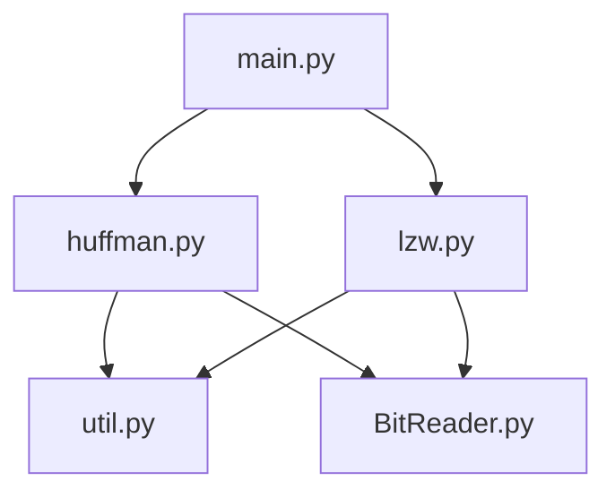

# Implementation

## Structure

## Time and space complexities

### Huffman

#### Encoding

When encoding, we first go through the whole text file to calculate the frequencies of different characters. The time complexity of this is O(n). Then we create a Huffman tree by using priority queue (heap). This is done by taking two nodes at a time from the priority queue, adding them as children of a new node, and adding the newly created parent node back to the queue. This will go on for as long as there are more than one items in the queue. Taking one element out of the queue takes O(log(k)) time and it is done k times, where k is the amount of unique characters in the given text file. Next, we calculate the shape of the tree and add all the codes to a dictionary by traversing the tree with depth first search. The maximum amount of nodes in the tree is 2^(log2(k) + 1) - 1 so this will take O(2^log(k)) time. Next, we format the unique characters to 16 bit unicode values, which takes O(k) time. Finally, we encode all the characters in the text file one by one using the dictionary, which takes O(n) time. Now we have 2O(n) + O(klog(k)) + O(2^log(k)) + O(k). If we consider a hard limit for the given unique characters k, we are left with a time complexity of O(n). If we write the encoded data in chunks, we are left with a space complexity of O(1).

#### Decoding

When decoding, we first recreate the Huffman tree used when encoding. This again takes O(2^(log2(k))) time. Then we traverse the tree for each encoded character n times, which takes O(nlog2(k)) time. If we consider a hard limit for the given unique characters, we are left with a time complexity of O(n). If we read the encoded data in chunks, we are left with a space complexity of O(1).

### Lempel-Ziv-Welch

#### Encoding

When encoding, we add each character in a text file to a substring until the substring doesn't exist in a dictionary that's initialized with codes for a set of characters (for example UTF-8) at the start of the algorithm. After finding a substring that doesn't exist in the dictionary, the algorithm adds it to the dictionary. The time complexity of going through all the characters like this is O(n), where n is the amount of characters. If we write the encoded data in chunks, we are left with a space complexity of O(1).

#### Decoding

LZW decoding kind of does the encoding in inverse. It first initializes a dictionary with characters for a set of codes. Then it extracts one substring at a time from the encoded data and adds substrings to the dictionary as they come. The time complexity of going through all the characters like this is O(n). If we read the encoded data in chunks, we are left with a space complexity of O(1).

## Comparison

### Speed

Although the big O notations of Huffman and LZW are the same, Huffman should be faster than LZW when encoding and slower when decoding. When encoding, Huffman simply gets each character's code from a dictionary, whereas LZW has to first check whether the substring about to be encoded already exists in the dictionary it uses. When decoding, Huffman extracts one bit at a time from the encoded data, whereas LZW extracts one substring at a time. Space complexities of the algorithms should be roughly the same.

### Compression ratio

LZW compresses longer, pattern rich texts better than Huffman because it works by finding bigger and bigger patterns that are encoded into more space-efficient codes. On the other hand, Huffman works better for shorter texts because it doesn't require an initial character space to start with.

## Improvements

The interface could be improved and the shape of the Huffman tree could maybe be calculated during creating the tree. Also, Huffman decoding is slower than expected and could probably be made faster.

## Sources

https://www.geeksforgeeks.org/huffman-coding-greedy-algo-3/  
https://people.cs.pitt.edu/~aus/cs1501/LZW.pdf  
https://en.wikipedia.org/wiki/Lempel%E2%80%93Ziv%E2%80%93Welch  
https://www.geeksforgeeks.org/properties-of-binary-tree/