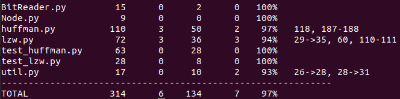

## Overview

I created unit tests for all functions with simple inputs and outputs that I calculated to be right by hand. The unit tests are made with native Python unittest library. The inputs are given as text or binary files and the outputs can be found from test_huffman.py and test_lzw.py. I also compared the speed and efficiency of both Huffman and LZW. The unit tests can be run with the command "python3 -m unittest".

## Huffman vs LZW

As we can see from the graph down below, LZW seems to be more efficient when file size increases. This is natural because LZW works by finding bigger and bigger patterns from the given text. The more there is text, the more these patterns will emerge.

### Huffman

| File | Size (kB) | Compressed size (kB) | Compressing time (s) | Decompressing time (s) |
| --------- | ---- | ---- | ----- | ---- |
| test1.txt | 17.3 | 10.2 | 0.01 | 0.06 |
| test2.txt | 35.4 | 20.3 | 0.01 | 0.12 |
| test3.txt | 70.9 | 40.1 | 0.03 | 0.22 |
| test4.txt | 134.3 | 76.9 | 0.05 | 0.45 |
| test5.txt | 241.6 | 141.2 | 0.08 | 0.76 |
| test6.txt | 435.3 | 258.0 | 0.16 | 1.40 |
| test7.txt | 873.4 | 520.3 | 0.30 | 2.76 |
| test8.txt | 1805.5 | 1076.6 | 0.59 | 5.68 |
| test9.txt | 3651.2 | 2178.0 | 1.17 | 11.35 |
| test.txt | 5468.8 | 3258.2 | 1.87 | 17.33 |

### LZW

| File | Size (kB) | Compressed size (kB) | Compressing time (s) | Decompressing time (s) |
| --------- | ---- | ---- | ---- | ---- |
| test1.txt | 17.3 | 12.7 | 0.03 | 0.03 |
| test2.txt | 35.4 | 22.7 | 0.04 | 0.04 |
| test3.txt | 70.9 | 40.3 | 0.06 | 0.05 |
| test4.txt | 134.3 | 70.9 | 0.11 | 0.10 |
| test5.txt | 241.6 | 117.6 | 0.18 | 0.13 |
| test6.txt | 435.3 | 200.3 | 0.28 | 0.23 |
| test7.txt | 873.4 | 373.5 | 0.50 | 0.41 |
| test8.txt | 1805.5 | 739.7 | 0.92 | 0.75 |
| test9.txt | 3651.2 | 1428.8 | 1.82 | 1.44 |
| test.txt | 5468.8 | 2092.3 | 2.85 | 2.12 |

## Code coverage report

